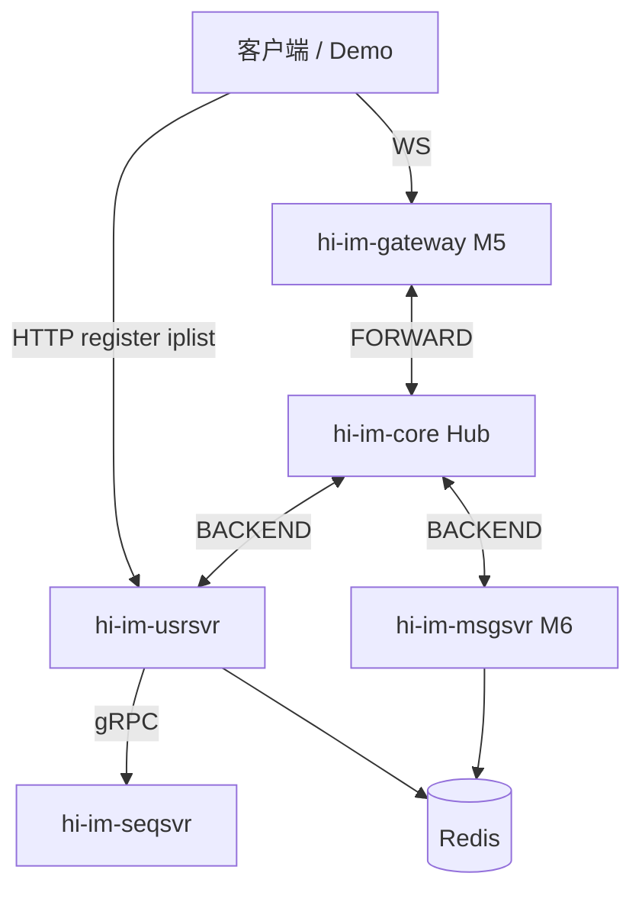

# hi-im-usrsvr 技术设计文档

> **组件**：hi-im-usrsvr（Go + Gin + hubclient）  
> **层级**：L3 业务服务（**独立部署**）  
> **必嗨等价**：`src/golang/exec/usrsvr`  
> **版本**：v0.1 · 2026-07-03  
> **生态**：对应 [hi-im/doc/hi-im-档C技术方案设计.md](https://github.com/sunchao1/hi-im/blob/main/doc/hi-im-档C技术方案设计.md) **生态 M4**（群聊生命周期 **M6**；iplist **M5**）

---

## 1. 定位与边界

### 1.1 是什么

**hi-im-usrsvr** 是 hi-im 生态的 **用户中心 / 会话状态服务**，职责分 **HTTP 冷路径** 与 **Hub BACKEND 热路径** 两类：

| 职责 | 平面 | 说明 |
|------|------|------|
| **HTTP 注册** | Gin | `GET /im/register` → gRPC `AllocSid` → 返回 `uid/sid` |
| **接入列表 / Token** | Gin | `GET /im/iplist` → gateway 地址 + 加密 ONLINE token（**M5** 与 gateway 联调） |
| **ONLINE / OFFLINE** | hubclient BACKEND | 校验 token、写 Redis 在线态、`AllocSeq`、回 `ONLINE_ACK` |
| **PING / 生命周期** | hubclient BACKEND | 心跳、踢线、SUB 等（M4 最小集：ONLINE + OFFLINE + PING） |
| **群生命周期** | hubclient BACKEND | 建群/加群/退群…；维护 **gid→uid/nid** Redis（**M6**） |

**双连接模型**（与必嗨一致，传输层换 hi-im-hubclient）：

```text
客户端 ──HTTP──► usrsvr（注册、iplist）
gateway ──publish──► Hub ──► usrsvr（ONLINE 等 IM 帧，BACKEND 平面）
usrsvr ──AsyncSend──► Hub ──► gateway（ACK / 踢线）
```

### 1.2 不是什么

| 不是 | 说明 |
|------|------|
| **WebSocket 接入** | 属 **hi-im-gateway**（M5） |
| **群聊消息 fan-out** | `CMD_GROUP_CHAT` 由 **hi-im-msgsvr** SUB 消费（M6） |
| **SID/SEQ 发号实现** | gRPC 调 **hi-im-seqsvr** |
| **聊天室 rid 逻辑** | 属 **hi-im-chatroom**（M7） |
| **对外 hi-im-sdk-go** | 客户端调 HTTP/WS，不直连 Hub |

### 1.3 与相邻组件分工

```text
register:
  Client ──GET /im/register──► usrsvr ──AllocSid──► seqsvr

online (经 gateway，M5+):
  Client ──WS ONLINE──► gateway ──publish──► Hub ──► usrsvr
  usrsvr ──AllocSeq──► seqsvr
  usrsvr ──写 Redis──► im:sid:*:attr …
  usrsvr ──AsyncSend ONLINE_ACK──► Hub ──► gateway ──► Client

group join (M6):
  usrsvr ──写 chat:gid:*:to:nid:zset──► Redis  （msgsvr fan-out 第一段索引）
```

| 组件 | 关系 |
|------|------|
| **hi-im-api** | header 编解码、proto、`rediskey`、`errno`、`httpx` |
| **hi-im-hubclient** | BACKEND TCP；`RegisterHandler` + `AsyncSend` |
| **hi-im-seqsvr** | gRPC：`AllocSid`、`AllocSeq`；M6 `AllocGid` |
| **hi-im-gateway** | M5：转发 ONLINE；iplist 返回 gateway 地址 |
| **hi-im-msgsvr** | M6：读 `chat:gid:{gid}:to:nid:zset`，**不**处理 GROUP-JOIN |
| **Redis** | 会话在线、群成员索引（M4 起会话键；M6 起群键） |

---

## 2. 在生态中的位置



| 里程碑 | 本仓交付 | 验收 |
|--------|----------|------|
| **M4** | 注册 + ONLINE + Redis | HTTP 拿 sid；ONLINE 写 Redis |
| **M5** | `/im/iplist` + token | gateway WS 握手后能 ONLINE |
| **M6** | 群 CREATE/JOIN/QUIT + gid 索引 | 双窗口群聊前置数据就绪 |
| **M7+** | 私聊好友/blacklist 等（可选） | 按产品裁剪 |

---

## 3. 必嗨对照

### 3.1 框架与依赖

| 必嗨 | hi-im-usrsvr |
|------|--------------|
| beego Router | **Gin** |
| `lib/rtmq` Proxy | **hi-im-hubclient**（BACKEND） |
| Thrift seqsvr 连接池 | **gRPC** `seqv1.SeqServiceClient` |
| redigo | **go-redis** 或 redigo（择一，M4 统一） |
| mgo / Mongo | **mongo-driver**（**M6+ 可选**；M4 可不要） |
| MySQL userdb | **可选 M4**；Demo 可仅 Redis + seqsvr |

### 3.2 HTTP 路由

| 必嗨 beego | hi-im Gin | 里程碑 |
|------------|-----------|--------|
| `GET /im/register` | 同路径 | **M4** |
| `GET /im/iplist` | 同路径 | **M5** |
| `GET /im/query` | 延后 | — |
| `POST /im/push` | 延后 | — |
| `GET /im/config` | 延后 | — |
| `GET /im/group/config` | 延后 | M6+ |

### 3.3 Hub SUB / Handler（BACKEND）

必嗨 `UsrSvrCntx.Register()` 注册表；hi-im 用 hubclient `RegisterHandler`：

| CMD | 必嗨 Handler | hi-im 里程碑 |
|-----|--------------|--------------|
| `0x0101` ONLINE | `UsrSvrOnlineHandler` | **M4** |
| `0x0103` OFFLINE | `UsrSvrOfflineHandler` | **M4** |
| `0x0105` PING | `UsrSvrPingHandler` | **M4** |
| `0x0301` GROUP_CREAT | `UsrSvrGroupCreatHandler` | **M6** |
| `0x0305` GROUP_JOIN | `UsrSvrGroupJoinHandler` | **M6** |
| `0x030B` GROUP_CHAT | — | **msgsvr**（usrsvr **不** SUB） |

**M4 SUB 最小集**：`0x0101,0x0103,0x0105`（`HIIM_SUB_CMDS` 环境变量）。

---

## 4. 核心流程

### 4.1 HTTP 注册

对齐 beehive `register_handler`：

```text
1. 解析 query：uid, nation, city, town（uid/nation 必填）
2. gRPC AllocSid() → sid
3. JSON 响应：{ uid, sid, nation, city, town, code:0, errmsg:"OK" }
```

- **不**写 Redis（注册仅分配 sid；上线时才写会话）。
- 响应壳使用 **hi-im-api** `httpx.Response` 字段风格（与必嗨 `HttpResp` 一致）。

### 4.2 iplist + Token（M5）

对齐 beehive `iplist`：

```text
1. 解析：type(WS/TCP), uid, sid, clientip
2. 按 type + 运营商/IP 字典选 gateway 地址列表（M5 Compose 可静态配置）
3. 生成 token：明文 "uid:{uid}:ttl:{ttl}:sid:{sid}:end" → 对称加密
4. JSON：{ uid, sid, type, token, expire, list[], code, errmsg }
```

Token 在 **ONLINE** 时由 `online_req_check` 解密校验（uid/sid/ttl）。

### 4.3 ONLINE

对齐 beehive `online_handler`（命名与步骤净室化）：

```text
1. hubclient Handler 收到 CMD_ONLINE payload（48B头 + imv1.Online）
2. header.Validate；proto.Unmarshal
3. 校验 token（uid/sid/ttl 与 req 一致）
4. gRPC AllocSeq(sid) → seq
5. Redis pipeline（TTL = CHAT_SID_TTL）：
     - ZADD sid/uid 集合
     - HMSET im:sid:{sid}:attr  → cid, uid, nid
     - SADD im:uid:{uid}:to:sid:set
6. 冲突检测：同 sid 不同 nid/cid → CleanSession + KICK 旧连接
7. 组 OnlineAck proto；header.Pack(CMD_ONLINE_ACK, seq=…)
8. hubclient.AsyncSend(CMD_ONLINE_ACK, gatewayNid, frame)
```

**注意**（必嗨文档）：

- ONLINE 帧 **header.sid** = gateway 连接 **cid**；**body.sid** = 注册得到的 **会话 sid**。

### 4.4 OFFLINE / PING（M4）

| CMD | 行为 |
|-----|------|
| OFFLINE | 清理 Redis 会话键；可选 NOTIFY |
| PING | 刷新 sid TTL；回 PONG |

---

## 5. Redis 键（M4 / M6）

使用 **hi-im-api** `pkg/rediskey`（禁止手写模板）：

### 5.1 M4 会话键

| 键 | 操作 | 时机 |
|----|------|------|
| `im:sid:{sid}:attr` | HMSET cid/uid/nid | ONLINE |
| `chat:sid:zset` / uid 集合 | ZADD + TTL | ONLINE |
| `im:uid:{uid}:to:sid:set` | SADD | ONLINE |

键名与必嗨 **字符串完全一致**（见 hi-im-api §8）。

### 5.2 M6 群键（预览）

| 键 | 写入方 | 消费者 |
|----|--------|--------|
| `chat:gid:{gid}:to:nid:zset` | usrsvr JOIN/QUIT | **msgsvr** fan-out |
| `chat:gid:{gid}:to:uid:zset` | usrsvr | 群成员查询 |
| `chat:gid:incr` | — | **废弃**；改 seqsvr `AllocGid` |

---

## 6. gRPC 客户端（seqsvr）

```go
import seqv1 "github.com/sunchao1/hi-im-api/gen/go/seq/v1"

conn, _ := grpc.Dial(cfg.SeqsvrAddr, grpc.WithTransportCredentials(insecure.NewCredentials()))
client := seqv1.NewSeqServiceClient(conn)

sid, _ := client.AllocSid(ctx, &seqv1.AllocSidRequest{})
seq, _ := client.AllocSeq(ctx, &seqv1.AllocSeqRequest{Sid: int64(sid)})
```

| RPC | 调用点 |
|-----|--------|
| `AllocSid` | HTTP register |
| `AllocSeq` | ONLINE |
| `AllocGid` | GROUP_CREAT（**M6**） |

连接池：M4 单连接 + 超时即可；高 QPS 时 `grpc.ClientConn` 复用。

---

## 7. hubclient 集成

### 7.1 配置

```bash
HIIM_BACKEND_ADDR=hub:28889
HIIM_NID=30001                    # usrsvr 全局唯一 NID
HIIM_AUTH_USER=proxy
HIIM_AUTH_PASS=proxy
HIIM_SUB_CMDS=0x0101,0x0103,0x0105   # M4；M6 追加 0x03xx
```

### 7.2 启动顺序

```text
1. 加载配置、Redis、gRPC seqsvr client
2. hubclient.New(ConfigFromEnv) + RegisterHandler(各 CMD)
3. hubclient.Start(ctx) + WaitReady
4. Gin Listen HTTP
5. 优雅退出：Close hubclient → 关 HTTP
```

### 7.3 下行 ACK

```go
frame := header.Pack(cmd.CMD_ONLINE_ACK, &header.Header{Sid: sessSid, Seq: seq, Nid: destGatewayNid, ...})
body, _ := proto.Marshal(ack)
payload := append(frame, body...)
client.AsyncSend(cmd.CMD_ONLINE_ACK, destGatewayNid, payload)
```

`destGatewayNid` 来自 ONLINE 帧 header 中的 gateway **nid**（必嗨 `head.GetNid()`）。

---

## 8. 仓库目录结构（规划）

```text
hi-im-usrsvr/
├── LICENSE
├── README.md
├── go.mod
├── cmd/usrsvr/main.go
├── internal/
│   ├── config/config.go
│   ├── http/
│   │   ├── router.go              # Gin 路由
│   │   ├── register.go            # GET /im/register
│   │   └── iplist.go              # GET /im/iplist（M5）
│   ├── hub/
│   │   ├── client.go              # 封装 hubclient 生命周期
│   │   ├── online.go              # CMD_ONLINE
│   │   ├── offline.go
│   │   ├── ping.go
│   │   └── group/                 # M6：create/join/quit…
│   ├── session/
│   │   ├── redis.go               # 会话读写、CleanSession
│   │   └── token.go               # iplist token 加解密
│   ├── seqsvr/client.go           # gRPC SeqService
│   └── health/health.go
├── deploy/docker/Dockerfile
├── test/
│   ├── register_http_test.go
│   ├── online_integration_test.go # hub + usrsvr + redis
│   └── group_integration_test.go  # M6
├── doc/
│   ├── README.md
│   ├── 技术设计文档.md
│   └── M1-实施清单.md
├── Makefile
└── .github/workflows/ci.yml
```

---

## 9. 依赖

```go
module github.com/sunchao1/hi-im-usrsvr

go 1.22

require (
    github.com/sunchao1/hi-im-api v0.1.0
    github.com/sunchao1/hi-im-hubclient v0.1.0
    github.com/gin-gonic/gin v1.10.x
    google.golang.org/grpc v1.6x.x
    github.com/redis/go-redis/v9 v9.x   // 或 redigo
)
```

| 依赖 | 用途 |
|------|------|
| hi-im-api | header、proto、rediskey、errno、httpx |
| hi-im-hubclient | BACKEND |
| gin | HTTP |
| grpc | seqsvr client |

**M4 可不引入**：Mongo、MySQL userdb、Kafka。

---

## 10. 配置与环境变量

| 变量 | 默认 | 说明 |
|------|------|------|
| `HIIM_HTTP_LISTEN` | `:8081` | Gin HTTP |
| `HIIM_BACKEND_ADDR` | — | Hub BACKEND |
| `HIIM_NID` | `30001` | 本进程 NID |
| `HIIM_AUTH_USER` / `HIIM_AUTH_PASS` | — | Hub 认证 |
| `HIIM_SUB_CMDS` | 见 §7.1 | 逗号分隔 hex |
| `HIIM_REDIS_ADDR` | `redis:6379` | 会话/群状态 |
| `HIIM_SEQSVR_ADDR` | `hi-im-seqsvr:50051` | gRPC |
| `HIIM_TOKEN_CIPHER` | — | iplist/ONLINE token 对称密钥（M5） |
| `HIIM_GATEWAY_ADDRS` | — | M5 iplist 静态 gateway 列表（逗号分隔） |

健康检查：`GET /healthz`、`GET /readyz`（Redis Ping + hubclient Ready + seqsvr 可选 Ping）。

---

## 11. 部署

### 11.1 Compose（hi-im 主仓 M4+）

```text
profile infra: redis, mysql（seqsvr）
profile biz:   hi-im-seqsvr, hi-im-usrsvr, hi-im-hub
```

usrsvr `depends_on`: hub healthy, redis healthy, seqsvr started。

### 11.2 扩缩容

| 项 | 策略 |
|----|------|
| 副本数 | M4～M5 **1 副本** 即可；多副本需 **SUB 单活** 或按 cmd 分片（档 C §7.4） |
| SUB | 同 CMD 多 Pod 会 **重复消费** publish；ONLINE 类 cmd 建议 **replicas=1** 或 `HIIM_SUB_OWNER` 选主 |
| gateway | M5 起独立 HPA，与 usrsvr 解耦 |

---

## 12. 测试策略

| 测试 | 目的 |
|------|------|
| `register_http_test` | mock seqsvr → HTTP 200 + sid |
| `online_integration` | hub + usrsvr + redis：发 ONLINE → Redis 有 attr → 收到 ACK |
| `token_test` | iplist token 加解密 ↔ ONLINE 校验 |
| `group_integration`（M6） | CREATE/JOIN 后 `gid:to:nid:zset` 含 gateway nid |

---

## 13. 生态 M4 验收（本仓库）

| 项 | 标准 |
|----|------|
| HTTP | `GET /im/register?uid=1&nation=86` → `sid>0` |
| gRPC | 注册路径调用 `AllocSid` |
| ONLINE | hub 注入 ONLINE 帧 → Redis `im:sid:{sid}:attr` 存在 uid/nid |
| SEQ | ONLINE 成功 → `AllocSeq` 被调用；ACK 带 seq |
| 边界 | **无** gateway、**无** GROUP-CHAT、**无** msgsvr |

**跨仓 M4**（档 C §11.3）：主仓 Compose + 脚本「注册 + ONLINE 写 Redis」exit 0。

---

## 14. 里程碑节奏

| 阶段 | 本仓 | 说明 |
|------|------|------|
| **M4** | register + ONLINE/OFFLINE/PING + Redis | 与 seqsvr 并行 |
| **M5** | `/im/iplist` + token + 静态 gateway 列表 | 供 gateway Demo |
| **M6** | 群 CREATE/JOIN/QUIT + `AllocGid` + gid zset | msgsvr 前置 |
| **M7+** | 私聊好友、push、query | 按需裁剪 |

---

## 15. 风险与决策

| ID | 决策 | 理由 |
|----|------|------|
| U1 | beego → **Gin** | 档 C §7.1 |
| U2 | rtmq → **hubclient BACKEND** | 与 hi-im-core 对齐 |
| U3 | M4 **不做** GROUP-CHAT SUB | fan-out 归 msgsvr；防 M3/M5 混淆 |
| U4 | M4 **不做** iplist | 属 M5 gateway 链；M4 集成测试直发 Hub |
| U5 | gid 发号 **M6 切 seqsvr AllocGid** | 与 seqsvr 设计 S4 一致 |
| U6 | Mongo/userdb **延后** | M4 验收不依赖 |
| U7 | rediskey **只 import hi-im-api** | 防键名漂移 |

| 风险 | 缓解 |
|------|------|
| 多副本重复处理 ONLINE | M4 单副本；M8 选主或 hash nid |
| token 密钥管理 | Compose `.env`；K8s Secret |
| gateway 地址发现 | M5 静态列表；M8 改 Redis/服务发现 |

---

## 16. 参考

| 文档 / 代码 | 路径 |
|-------------|------|
| 档 C 总方案 | [hi-im/doc/hi-im-档C技术方案设计.md](https://github.com/sunchao1/hi-im/blob/main/doc/hi-im-档C技术方案设计.md) |
| hi-im-seqsvr | [hi-im-seqsvr/doc/技术设计文档.md](https://github.com/sunchao1/hi-im-seqsvr/blob/main/doc/技术设计文档.md) |
| hi-im-api | [hi-im-api/doc/技术设计文档.md](https://github.com/sunchao1/hi-im-api/blob/main/doc/技术设计文档.md) |
| 必嗨 usrsvr | `beehive-im/src/golang/exec/usrsvr/` |
| 群聊 Demo 导读 | `beehive-im/doc/群聊Demo源码导读.md` |
| 主仓 Compose | [hi-im/doc/技术设计文档.md](https://github.com/sunchao1/hi-im/blob/main/doc/技术设计文档.md) §6 |

---

*文档版本：2026-07-03 · hi-im-usrsvr v0.1-draft*
